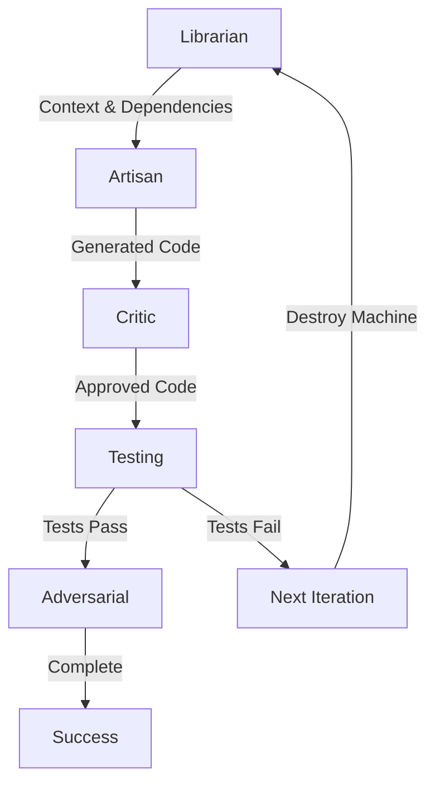

# Ralph Loop 2026

[](https://www.npmjs.com/package/ralph-loop)
[](https://opensource.org/licenses/MIT)
[](https://www.typescriptlang.org/)

**The Multi-Agent Iterative Testing System with Fresh Context Resets**

Ralph Loop 2026 is a next-generation autonomous testing and code generation system that uses multiple specialized AI agents to iteratively fix code until tests pass. Built on the principles of fresh context resets, intelligent error learning, and adversarial testing.

> **Evolution from Micro Agent**: Ralph Loop 2026 is the successor to Micro Agent, introducing multi-agent architecture, fresh context every iteration, intelligent memory learning, and adversarial chaos testing.

## ✨ Key Features

- 🤖 **Multi-Agent Architecture**: Librarian (Gemini), Artisan (Claude), Critic (GPT-4.1), Chaos (Claude)
- 🔄 **Fresh Context Every Iteration**: Prevents context pollution and eliminates token waste
- 🧠 **Intelligent Memory Vault**: Vector database learns from past fixes using semantic similarity
- 🎯 **Adversarial Testing**: Property-based tests, mutation testing, boundary fuzzing
- 🌍 **Polyglot Support**: TypeScript, JavaScript, Python, Rust
- 🔌 **Plugin System**: Extend with custom lifecycle hooks (10 hook points)
- 💰 **Budget-Aware**: Automatic cost tracking with configurable limits
- 🛡️ **Sandboxed Execution**: Isolated test runs in Docker containers
- ⚡ **Circuit Breaker**: Entropy detection prevents infinite loops

## 🚀 Quick Start

### Installation

```bash
# Global installation
npm install -g ralph-loop

# Or use locally
npm install ralph-loop --save-dev
```

### Basic Usage

```bash
# Fix a failing file
ralph fix src/utils/calculator.ts

# Run on entire directory
ralph fix src/

# Watch mode (auto-fix on changes)
ralph watch src/
```

### Example Output

```
🚀 Ralph Loop 2026 - Multi-Agent Iterative Testing
   Session: abc123, Budget: 30 iterations, $2.00 max

🔍 Iteration 1/30
   📚 Librarian (Gemini): Analyzed 3 files, found 12 dependencies
   ✍️  Artisan (Claude): Generated fix for TypeError at line 42
   🔎 Critic (GPT-4.1): Code quality 85/100, suggested 2 improvements
   🧪 Tests: 8/10 passed (2 failures)
   💥 Chaos: Skipped (tests didn't pass)

🔍 Iteration 2/30
   ✍️  Artisan: Improved error handling based on memory vault
   🧪 Tests: 10/10 passed ✅
   💥 Chaos: Running adversarial tests...
      - Property tests: 15/15 passed
      - Mutation score: 85% (17/20 killed)
      - Boundary tests: 12/12 passed

🎉 SUCCESS! Tests pass + Chaos tests complete
   💰 Cost: $0.23  |  ⏱️  Duration: 45s  |  🔄 Iterations: 2
   💾 Fix pattern saved to memory vault
```

## 📖 Documentation

- **[Quick Start Guide](./specs/001-ralph-loop-2026/quickstart.md)** - Get started in 5 minutes
- **[Configuration Guide](#configuration)** - Customize models and settings
- **[Plugin System](./specs/001-ralph-loop-2026/quickstart.md#plugin-system)** - Extend functionality
- **[Architecture](./specs/001-ralph-loop-2026/plan.md)** - Technical deep dive

## ⚙️ Configuration

Create `ralph.config.yaml` in your project root:

```yaml
# AI Model Assignments
models:
  librarian:
    provider: google
    model: gemini-2.0-pro
    temperature: 0.3  # Low temp for precise analysis

  artisan:
    provider: anthropic
    model: claude-sonnet-4.5
    temperature: 0.7  # Moderate temp for code generation

  critic:
    provider: openai
    model: gpt-4.1-mini
    temperature: 0.2  # Low temp for strict review

  chaos:
    provider: anthropic
    model: claude-sonnet-4.5
    temperature: 0.9  # High temp for creative adversarial thinking

# Budget Constraints
budgets:
  maxIterations: 30
  maxCostUsd: 2.0
  maxDurationMinutes: 15

# Testing Strategies
testing:
  adversarialTests: true
  propertyBasedTests: true
  mutationTesting: true
  boundaryValueTesting: true

# Success Criteria
successCriteria:
  testsPass: true
  adversarialTestsPass: true
  coverageThreshold: 90
  mutationScoreMin: 80

# Memory & Learning
memory:
  vectorDb: chromadb
  similarityThreshold: 0.85
  maxPatterns: 1000
  contextResetFrequency: 1  # GOLD STANDARD: Fresh context every iteration
```

### Environment Variables

```bash
# AI Provider API Keys
export ANTHROPIC_API_KEY=sk-ant-...
export OPENAI_API_KEY=sk-...
export GOOGLE_API_KEY=...

# Optional: Local LLM endpoints
export OLLAMA_BASE_URL=http://localhost:11434
```

## 🏗️ Architecture

### Multi-Agent State Machine



**Agents**:
- **Librarian (Gemini)**: Context analysis, dependency graphing, file ranking
- **Artisan (Claude)**: Code generation and fixes with 0.7 temperature
- **Critic (GPT-4.1)**: Code quality review, logic verification
- **Chaos (Claude)**: Adversarial testing with 0.9 temperature

### Fresh Context Reset (GOLD STANDARD)

Every iteration destroys the previous state machine and creates a fresh one:

```typescript
for (let iteration = 0; iteration < maxIterations; iteration++) {
  // Create fresh state machine
  const machine = createRalphMachine(sessionId, iteration, targetFile, config);

  // Execute iteration
  const result = await executeMachine(machine);

  if (result.success) {
    await memoryVault.storeFixPattern(result.fix);
    break;
  }

  // Machine is destroyed - fresh context for next iteration
  // No context pollution, no token waste
}
```

**Benefits**:
- ✅ No context pollution across iterations
- ✅ Prevents cascading errors from bad state
- ✅ Each iteration starts with clean slate
- ✅ Optimal token usage (only pay for what you need)

### Memory Vault Learning

```typescript
// Store successful fix
await memoryVault.storeFixPattern({
  errorSignature: '[LOGIC] expected 5 but got 3',
  solution: 'Changed += to = in accumulator',
  context: ['calculator.ts', 'sum function'],
  successRate: 1.0,
  timesApplied: 1
});

// Retrieve similar fixes using vector similarity
const fixes = await similaritySearch.search({
  errorMessage: 'expected 10 but got 8',
  context: ['calculator.ts']
});
// Returns top 5 most similar past fixes with relevance scores
```

**Similarity Scoring**:
- Category match: 30% weight
- Context overlap (Jaccard): 50% weight
- Recency (exponential decay): 20% weight
- Bonuses: success rate >80% (+10%), popularity >5 uses (+5%)

## 🎯 Use Cases

### 1. Fix Failing Tests

```bash
ralph fix src/api/auth.ts

# Ralph will:
# 1. Analyze test failures (Librarian)
# 2. Search memory for similar fixes
# 3. Generate and apply fix (Artisan)
# 4. Review code quality (Critic)
# 5. Verify tests pass
# 6. Run adversarial tests (Chaos)
# 7. Store successful pattern
```

### 2. Improve Test Coverage

```bash
ralph coverage src/utils/ --threshold 90

# Generates additional tests to reach 90% coverage
```

### 3. Adversarial Testing Only

```bash
ralph chaos src/critical-module.ts

# Runs:
# - Property-based tests (fast-check)
# - Mutation testing (Stryker)
# - Boundary value fuzzing
# - Reports survived mutations
```

### 4. Continuous Integration

```yaml
# .github/workflows/ralph.yml
name: Ralph Loop CI
on: [push, pull_request]

jobs:
  ralph:
    runs-on: ubuntu-latest
    steps:
      - uses: actions/checkout@v3
      - uses: actions/setup-node@v3
      - run: npm install -g ralph-loop
      - run: ralph fix src/ --ci --max-cost 1.0
```

## 🔌 Plugin System

Extend Ralph Loop with custom lifecycle hooks:

```typescript
// plugins/slack-notifier.ts
import type { RalphPlugin } from 'ralph-loop/plugin-sdk';

export const slackPlugin: RalphPlugin = {
  name: 'slack-notifications',
  version: '1.0.0',

  async onSuccess(context, results) {
    await fetch(process.env.SLACK_WEBHOOK!, {
      method: 'POST',
      body: JSON.stringify({
        text: `✅ Iteration ${context.iteration} succeeded in ${results.duration}s!`
      })
    });
  },

  async onTestFail(context, failure) {
    await fetch(process.env.SLACK_WEBHOOK!, {
      method: 'POST',
      body: JSON.stringify({
        text: `❌ Test failed: ${failure.testName}\n${failure.errorMessage}`
      })
    });
  },

  async onBudgetExceeded(context, budget) {
    await fetch(process.env.SLACK_WEBHOOK!, {
      method: 'POST',
      body: JSON.stringify({
        text: `⚠️ Budget exceeded: ${budget.exceeded} limit reached`
      })
    });
  }
};
```

**Configuration (`ralph-plugins.yaml`):**

```yaml
plugins:
  - plugin: ./plugins/slack-notifier.ts
    enabled: true
    config:
      timeout: 5000
      failOnError: false
      hooks:
        onSuccess: true
        onTestFail: true
        onBudgetExceeded: true
```

**10 Lifecycle Hooks**: `onBeforeGen`, `onAfterGen`, `onTestFail`, `onBeforeSuccess`, `onSuccess`, `onFailure`, `onContextReset`, `onBudgetExceeded`, `onEntropyDetected`, `initialize/cleanup`

## 🧪 Language Support

| Language   | Test Framework      | Coverage Tool    | Status |
|------------|---------------------|------------------|--------|
| TypeScript | Vitest, Jest        | c8, Istanbul     | ✅     |
| JavaScript | Vitest, Jest        | c8, Istanbul     | ✅     |
| Python     | pytest              | coverage.py      | ✅     |
| Rust       | cargo test          | cargo-tarpaulin  | ✅     |
| Go         | go test             | go cover         | 🚧     |
| Java       | JUnit               | JaCoCo           | 🚧     |

## 💡 Advanced Features

### Circuit Breaker (Entropy Detection)

Automatically stops when detecting repeating errors:

```yaml
budgets:
  maxIterations: 30  # Hard limit

# Entropy detection:
# - If same error signature appears 3+ times → circuit breaker triggers
# - Adversarial failures DON'T count toward entropy
# - Prevents infinite loops on unsolvable problems
```

### Budget Tracking

Real-time budget monitoring:

```typescript
{
  iterations: { current: 5, max: 30 },
  cost: { current: 0.45, max: 2.0 },
  duration: { current: 120, max: 900 }
}

// Stops when ANY limit is exceeded
```

### Intelligent Backtracking

For adversarial test failures:
- ✅ Unit tests pass → ✅ Code is working
- ⚠️ Adversarial tests fail → Informational only
- System proceeds to completion
- Adversarial failures are logged but don't block success
- Doesn't count toward entropy threshold

## 📊 Metrics & Analytics

Ralph Loop tracks:
- **Tokens Used**: Per agent, per iteration, cumulative
- **Cost**: Real-time calculation with provider-specific pricing
- **Duration**: Wall-clock time per iteration and total
- **Success Rate**: Fix pattern success rate over time
- **Coverage**: Code coverage percentage
- **Mutation Score**: Test quality metric (killed/total mutations)
- **Context Usage**: Token usage per agent (with 40% reset threshold)

## 🛠️ Development

### Build from Source

```bash
git clone https://github.com/ralph-loop/ralph.git
cd ralph
npm install
npm run build
```

### Run Tests

```bash
npm test                 # Unit tests
npm run test:integration # Integration tests
npm run test:e2e        # End-to-end tests
npm run test:chaos      # Chaos/adversarial tests
```

## 🤝 Contributing

Contributions welcome! See [CONTRIBUTING.md](./CONTRIBUTING.md).

**Areas for Contribution**:
- 🌐 Additional language support (Go, Java, C++)
- 🔌 Community plugins
- 📚 Documentation improvements
- 🐛 Bug fixes
- ✨ Feature requests

## 📄 License

MIT License - see [LICENSE](./LICENSE)

## 🙏 Acknowledgments

Built on the shoulders of giants:
- **Anthropic Claude** - Code generation and chaos testing
- **Google Gemini** - Context analysis and dependency graphing
- **OpenAI GPT** - Code review and quality assurance
- **ChromaDB** - Vector similarity search for memory vault
- **XState** - State machine orchestration
- **Stryker** - Mutation testing framework
- **fast-check** - Property-based testing library

## 📞 Support

- 🐛 **Bug Reports**: [GitHub Issues](https://github.com/ralph-loop/ralph/issues)
- 💬 **Discord**: [Join Community](https://discord.gg/ralph-loop)
- 📧 **Email**: support@ralph-loop.dev
- 📖 **Docs**: [ralph-loop.dev/docs](https://ralph-loop.dev/docs)

## 🗺️ Roadmap

- [ ] Real-time collaboration mode (multiple developers)
- [ ] Web dashboard for monitoring iterations
- [ ] VS Code extension with inline suggestions
- [ ] More language support (Go, Java, C++, Swift)
- [ ] Cloud-hosted memory vault sharing
- [ ] Advanced analytics dashboard
- [ ] Integration with GitHub Copilot
- [ ] Self-hosted LLM support (Llama, Mistral)

---

**Built with ❤️ by the Ralph Loop team**

*Making AI-powered testing accessible and reliable for everyone*

> **Note**: This project evolved from [Micro Agent](https://github.com/BuilderIO/micro-agent) by Builder.io, reimagined with multi-agent architecture, fresh context resets, and intelligent memory learning.
